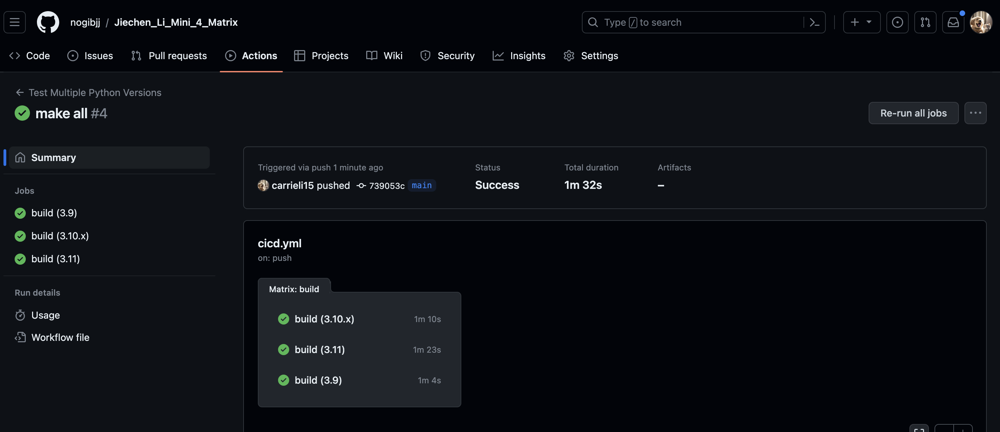

# Jiechen_Li_Mini_4_Matrix Build

## Purpose
Create a GitHub Actions Matrix Build that tests at least **three versions of Python**.

## Requirements
* Python (Version 3.9 or 3.10 and 3.11)
* Pandas (Version 2.0.3)
* Matplotlib (Version 3.7.3)

## Run
* install code `make install`

* lint code `make lint`
   
* format code `make format`

* test code `make test`

## Output

## Reference

Please refer to <a href="https://github.com/nogibjj/matrix-testing" target="_blank">Professor Gift's Template</a>.

